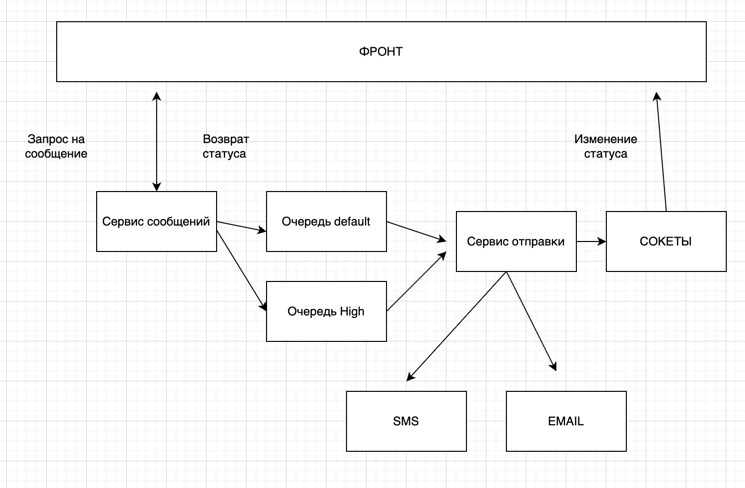

# TEST TASK Laravel Project

## Описание

Тестовое задание на Laravel 12, обеспечивающее отправку сообщений и поиск по статусу и каналу REST API.  
Реализация патерна Strategy так же иcпользованы Dto, service layer, enums, Dependency Injection.
Добавление нового канала не требует изменений в текущем коде отправки но требует добавить тип в enum, 
зарегестрировать его в сервис провайдере и добавить саму реализацию отправки. Так как реализация отправки
может существенно отличаться у каждого сервиса. Так мы соблюдаем SOLID, не изменяем а дополняем,
разделяем ответственность и зависим от абстракций. Плюс добавлен механизм от предотвращение дублей. 
Отправка сделана асинхронно через очереди, сделано так для того чтобы не ждать ответа от API 
сервиса отправки, а просто регим сообщение, отдаем на фронт сущность со статусом ожидает отправки.
Отправку передаем в очередь, где воркер их уже разбирает, при изменении статуса сообщения фиксируется
через observer отправляет через сокеты автору сообщения.   

## Резюмируем
### Слоай данных
   1. **Enums**  обеспечивают строгую типизацию и исключают ошибку
   2. **DTO** разделяют данные запроса и данные для внутренней логики делая код независимым
### Слой логики 
   1. **SendService** Является диспетчером. Он не знает, как отправлять сообщения, он знает только, кому делегировать задачу
   2. **NotificationProvider** Является интерфейсом(абстракцией) от которого завият все реализации
   3. **Расширяемость** Чтобы добавить новый канал (например, Telegram), достаточно создать SmsProvider и добавить одну строку в AppServiceProvider. Основной код SendService остается нетронутым выполнояем Open-Closed
### Асинхронность
   1. **Job**  Исключает задержки API. Ответ бекенда мнгновенный без задержек
   2. **Инфраструктура** Используем RebbitMQ как транспорт
### Гибкость
   1. **Гибкая доставка** доставка использует очереди с периодом отправки и кол-вом запросов
### Реактивность
   1. **NotificationObserver**  Инкапсулирует логику побочных эффектов. Как только воркер обновляет статус в БД на COMPLETED или ERROR, фиксируем это дейстие
   2. **SocketService**  Отправляет уведомление автору через сокеты. Это избавляет фронтенд от необходимости постоянно опрашивать  API для обновления статуса.
### Инфрастуктура
   1. **Контейнеризация**  позволяет развернуть проект одной командой docker-compose up -d --build.

---

## Структура Docker

Файл `docker-compose.yml` содержит четыре основных сервиса:

1.   **smart_logistic_php** – PHP-контейнер с Laravel.
2.   **smart_logistic_nginx_server** – Nginx для отдачи запросов.
3.   **smart_logistic_rabbitmq_server** – Контейнер для очередей.
4.   **smart_logistic_queue** – Контейнер очередей.
5.   **smart_logistic_redis_server** – Для кеша redis.
6.   **smart_logistic_postgres_db** – PostgreSQL база данных.

---
## OPENAPI

 {url}/openapi#/

## Быстрый старт (Docker)

1. **Клонируем проект**

git clone <репозиторий>

2. **Собираем контейнеры**

docker compose up -d --build 

3. **Геренация OPENAPI**
docker exec -it housing_laravel_php php artisan swagger:generate
